# Agent Swarm - AI Agents Architecture

## System Overview Diagram


---

## Research Agent Detail

```mermaid
sequenceDiagram
    participant Workflow as Research Workflow
    participant Swarm as Swarm Coordinator
    participant Agent as Research Agent<br/>(researcher-1)
    participant LLM as LLM Client
    participant API as OpenAI/Anthropic API
    participant Events as Event Bus
    participant Web as Web Dashboard

    Note over Workflow: Step 1: Research Phase
    Workflow->>Swarm: Task{id: "research-001", type: "research"}
    Swarm->>Agent: Route task to researcher-1

    Agent->>Events: Publish: EventTaskReceived 📥
    Events-->>Web: Update event stream

    Agent->>Events: Publish: EventTaskStarted ⚙️
    Events-->>Web: Set agent status: processing

    Note over Agent: Build system prompt:<br/>"You are a research specialist..."
    Note over Agent: Build user prompt:<br/>"Research Task: quantum computing..."

    Agent->>LLM: Complete(system, user, history)
    LLM->>API: POST /v1/chat/completions

    Note over API: GPT-4 generates<br/>comprehensive research<br/>(10-30 seconds)

    API-->>LLM: Research findings (markdown)
    LLM-->>Agent: Research report text

    Note over Agent: Update conversation history<br/>(keep last 6 messages)

    Agent->>Events: Publish: EventTaskCompleted ✅<br/>Data: Full research report
    Events-->>Web: Display results panel
    Events-->>Workflow: Task complete signal

    Note over Workflow: Context = {research_findings: ...}
```



---

## Analysis Agent Detail


---

## Report Agent Detail

```mermaid
sequenceDiagram
    participant Workflow as Research Workflow
    participant Swarm as Swarm Coordinator
    participant Agent as Report Agent<br/>(reporter-1)
    participant LLM as LLM Client
    participant API as OpenAI/Anthropic API
    participant Events as Event Bus
    participant User as User (CLI)

    Note over Workflow: Step 3: Report Phase<br/>Context includes ALL previous results
    Workflow->>Swarm: Task{id: "report-001", type: "report",<br/>context: {research_findings: ...,<br/>analysis_insights: ...}}
    Swarm->>Agent: Route task to reporter-1

    Agent->>Events: Publish: EventTaskReceived 📥
    Agent->>Events: Publish: EventTaskStarted ⚙️

    Note over Agent: System prompt:<br/>"You are a professional report writer..."
    Note over Agent: User prompt includes:<br/>- Task description<br/>- Research findings<br/>- Analysis insights

    Agent->>LLM: Complete(system, user, history)
    LLM->>API: POST /v1/chat/completions

    Note over API: AI synthesizes all data into<br/>executive-ready report<br/>(10-30 seconds)

    API-->>LLM: Professional report (markdown)
    LLM-->>Agent: Complete report text

    Agent->>Events: Publish: EventTaskCompleted ✅<br/>Data: Full executive report
    Events-->>Workflow: Task complete signal

    Workflow->>User: Display complete workflow results:<br/>- Research findings<br/>- Analysis insights<br/>- Final report
```



---

## Agent State Machine


---

## Event Flow Diagram

```mermaid
graph LR
    subgraph "Agent Events"
        E1[📥 EventTaskReceived<br/>Agent got task]
        E2[⚙️ EventTaskStarted<br/>Agent processing]
        E3[✅ EventTaskCompleted<br/>Task succeeded]
        E4[❌ EventTaskFailed<br/>Task failed]
    end

    subgraph "Event Bus"
        BUS[Event Publisher/Subscriber]
    end

    subgraph "Subscribers"
        WEB[Web Dashboard<br/>WebSocket Stream]
        WORKFLOW[Research Workflow<br/>Task Completion Monitor]
        LOG[Console Logger<br/>Terminal Output]
    end

    E1 --> BUS
    E2 --> BUS
    E3 --> BUS
    E4 --> BUS

    BUS --> WEB
    BUS --> WORKFLOW
    BUS --> LOG

    WEB -.->|Update| UI1[Event Stream Panel]
    WEB -.->|Update| UI2[Agent Status Cards]
    WEB -.->|Update| UI3[Task Results Panel]
    WEB -.->|Update| UI4[Statistics Counters]

    style E1 fill:#2196F3,color:#fff
    style E2 fill:#FF9800,color:#fff
    style E3 fill:#4CAF50,color:#fff
    style E4 fill:#F44336,color:#fff
```



---

## Data Flow: Context Passing Between Agents

```mermaid
flowchart TD
    START([User enters topic:<br/>"quantum computing"])

    TASK1[Task 1: Research<br/>context: empty {}]
    AGENT1[Research Agent<br/>LLM Call #1]
    RESULT1[Result 1:<br/># Research Findings<br/>- Key points...<br/>- Evidence...]

    TASK2[Task 2: Analysis<br/>context: {research_findings}]
    AGENT2[Analysis Agent<br/>LLM Call #2]
    RESULT2[Result 2:<br/># Analysis Insights<br/>- Patterns...<br/>- Correlations...]

    TASK3[Task 3: Report<br/>context: {research, analysis}]
    AGENT3[Report Agent<br/>LLM Call #3]
    RESULT3[Result 3:<br/># Executive Report<br/>- Summary...<br/>- Recommendations...]

    END([Display to User])

    START --> TASK1
    TASK1 --> AGENT1
    AGENT1 --> RESULT1

    RESULT1 -->|Add to context| TASK2
    TASK2 --> AGENT2
    AGENT2 --> RESULT2

    RESULT2 -->|Add to context| TASK3
    TASK3 --> AGENT3
    AGENT3 --> RESULT3

    RESULT3 --> END

    style AGENT1 fill:#4CAF50,stroke:#2E7D32,stroke-width:2px,color:#fff
    style AGENT2 fill:#2196F3,stroke:#1565C0,stroke-width:2px,color:#fff
    style AGENT3 fill:#FF9800,stroke:#E65100,stroke-width:2px,color:#fff
```

---

## Agent Comparison Matrix

| Feature | Research Agent | Analysis Agent | Report Agent |
|---------|---------------|----------------|--------------|
| **Primary Function** | Gather information | Identify patterns | Synthesize findings |
| **System Prompt** | "Research specialist" | "Data analyst specialist" | "Professional report writer" |
| **Input** | Topic description | Research findings | Research + Analysis |
| **Output** | Research report | Analysis insights | Executive report |
| **Output Sections** | • Executive summary<br/>• Key findings<br/>• Evidence<br/>• Trends | • Data quality<br/>• Patterns<br/>• Insights<br/>• Recommendations | • Executive summary<br/>• Findings<br/>• Analysis<br/>• Recommendations |
| **Context Required** | None (first step) | Research findings | All previous results |
| **LLM Behavior** | Comprehensive research | Pattern identification | Professional synthesis |
| **Typical Response Time** | 15-30 seconds | 15-30 seconds | 15-30 seconds |
| **History Tracking** | Last 6 messages | Last 6 messages | Last 6 messages |
| **Event Publishing** | 3 events per task | 3 events per task | 3 events per task |

---

## Agent Lifecycle


---

## File Structure

```
pkg/agents/
├── research_agent.go     📚 Research specialist (this file)
├── analysis_agent.go     📊 Analysis specialist (similar structure)
├── report_agent.go       📝 Report generator (similar structure)
└── AGENTS_DIAGRAM.md     📖 This documentation file
```

---

## Quick Reference: Key Functions

### ResearchAgent
```go
// Creation
researcher := agents.NewResearchAgent("researcher-1", eventBus)

// Automatic handling (registered handler)
// handleTask(msg) - Called when task arrives
// ProcessTask(task) - Performs LLM research

// Specialty
researcher.GetSpecialty() // Returns "research"
```

### AnalysisAgent
```go
// Creation
analyzer := agents.NewAnalysisAgent("analyzer-1", eventBus)

// Specialty
analyzer.GetSpecialty() // Returns "analysis"
```

### ReportAgent
```go
// Creation
reporter := agents.NewReportAgent("reporter-1", eventBus)

// Specialty
reporter.GetSpecialty() // Returns "reporting"
```

---

## Integration Example

```go
// In cmd/main.go
func main() {
    // Create swarm
    s := swarm.NewSwarm()

    // Create all three agents
    researcher := agents.NewResearchAgent("researcher-1", s.GetEventBus())
    analyzer := agents.NewAnalysisAgent("analyzer-1", s.GetEventBus())
    reporter := agents.NewReportAgent("reporter-1", s.GetEventBus())

    // Add to swarm
    s.AddAgent(researcher)
    s.AddAgent(analyzer)
    s.AddAgent(reporter)

    // Start all agents
    s.Start(ctx)

    // Agents now ready to receive and process tasks
}
```

---

## See Also

- **CODE_DOCUMENTATION.md** - Complete system documentation
- **README.md** - User guide and features
- **QUICK_START.md** - Getting started guide
- **pkg/workflows/research_workflow.go** - Workflow orchestration
- **pkg/llm/client.go** - LLM API integration

---

*Generated for Agent Swarm Go - AI-Powered Multi-Agent System*