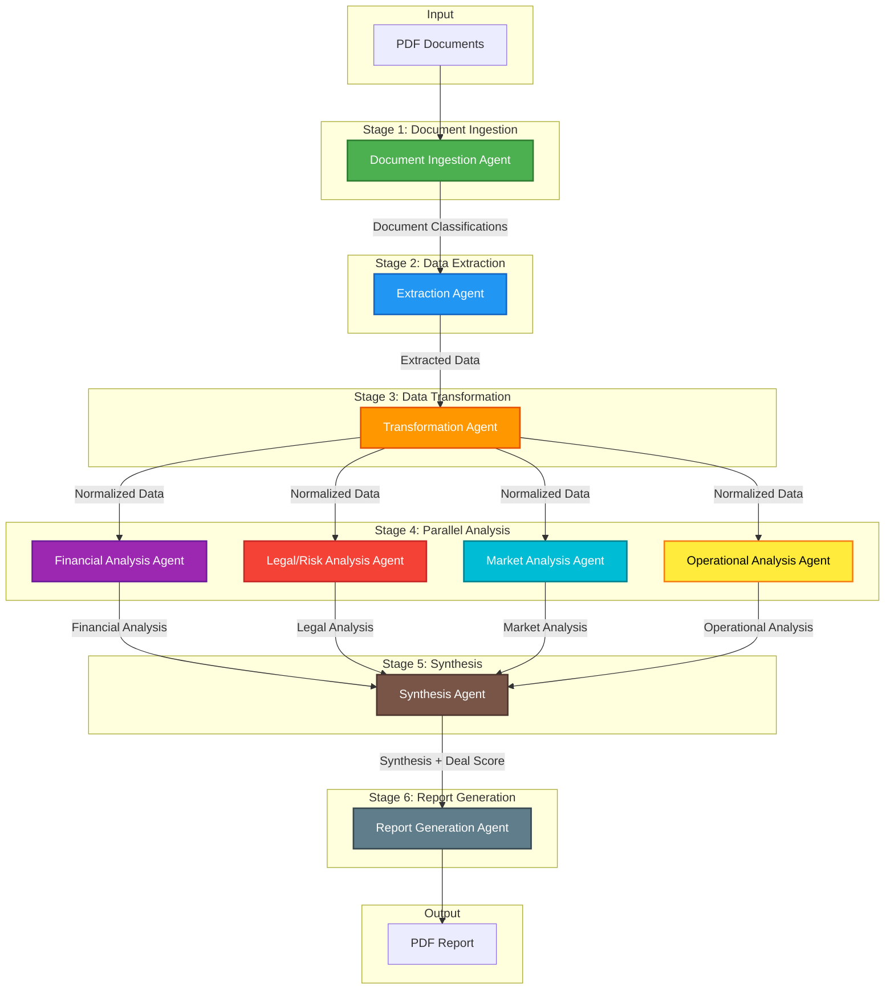
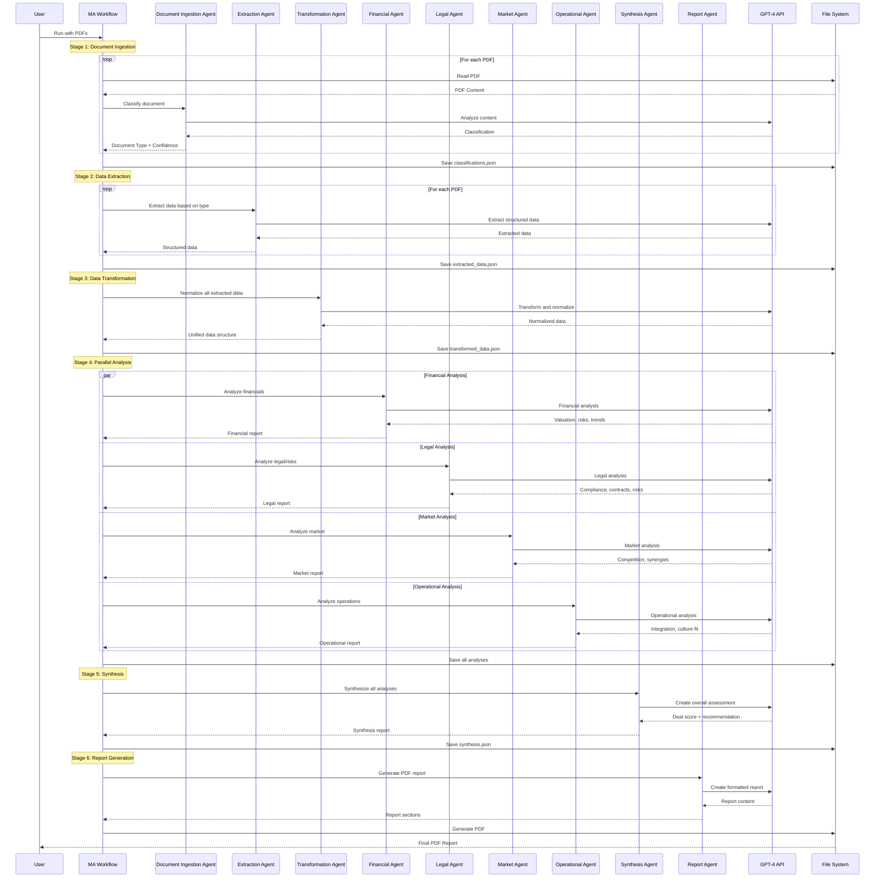
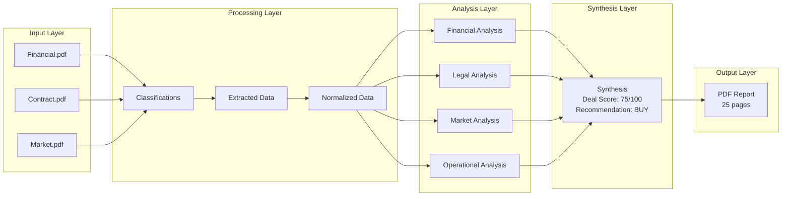

# M&A Agent Swarm Architecture

## System Overview

**9 Specialized AI Agents** working in a **sequential pipeline** to perform M&A due diligence.

## Agent Pipeline



## Detailed Workflow



## Agent Details

### Agent 1: Document Ingestion Agent
- **Purpose**: Classify PDF documents into categories
- **Input**: PDF file path and preview text
- **Output**: Document type (financial_statement, legal_contract, market_research, etc.), confidence score, summary
- **Model**: GPT-4o

### Agent 2: Extraction Agent
- **Purpose**: Extract structured data based on document type
- **Input**: Full PDF text + document type
- **Output**: Structured data (financial metrics, legal terms, market data, etc.)
- **Model**: GPT-4o

### Agent 3: Transformation Agent
- **Purpose**: Normalize and standardize extracted data
- **Input**: All extracted data from multiple documents
- **Output**: Unified, normalized data structure
- **Model**: GPT-4o

### Agent 4: Financial Analysis Agent
- **Purpose**: Perform financial due diligence
- **Input**: Normalized financial data
- **Output**: Valuation analysis, financial health, trends, risks
- **Model**: GPT-4o

### Agent 5: Legal/Risk Analysis Agent
- **Purpose**: Analyze legal and compliance risks
- **Input**: Normalized legal data
- **Output**: Compliance issues, contractual risks, litigation concerns
- **Model**: GPT-4o

### Agent 6: Market Analysis Agent
- **Purpose**: Analyze market position and competitive landscape
- **Input**: Normalized market data
- **Output**: Market position, synergies, opportunities, risks
- **Model**: GPT-4o

### Agent 7: Operational Analysis Agent
- **Purpose**: Assess operational fit and integration
- **Input**: Normalized operational data
- **Output**: Integration complexity, cultural fit, operational risks
- **Model**: GPT-4o

### Agent 8: Synthesis Agent
- **Purpose**: Combine all analyses into overall assessment
- **Input**: All 4 analysis reports
- **Output**: Deal score (0-100), key findings, critical risks, recommendation
- **Model**: GPT-4o

### Agent 9: Report Generation Agent
- **Purpose**: Create comprehensive PDF report
- **Input**: All analyses + synthesis
- **Output**: Structured report content
- **Model**: GPT-4o
- **Post-processing**: PDF generation via PDFKit

## Data Flow



## Technology Stack

- **Framework**: Mastra (TypeScript AI agent framework)
- **LLM**: OpenAI GPT-4o
- **PDF Parsing**: pdf-parse
- **PDF Generation**: PDFKit
- **Data Storage**: Local JSON files
- **Language**: TypeScript/Node.js

## File Structure

```
ma-agent-swarm/
├── src/
│   ├── agents/                     # 9 AI agent definitions
│   │   ├── document-ingestion-agent.ts
│   │   ├── extraction-agent.ts
│   │   ├── transformation-agent.ts
│   │   ├── financial-analysis-agent.ts
│   │   ├── legal-risk-agent.ts
│   │   ├── market-analysis-agent.ts
│   │   ├── operational-analysis-agent.ts
│   │   ├── synthesis-agent.ts
│   │   └── report-generation-agent.ts
│   ├── workflows/
│   │   └── ma-workflow.ts          # Sequential orchestrator
│   ├── tools/
│   │   ├── pdf-parser.ts           # PDF text extraction
│   │   └── pdf-generator.ts        # PDF report creation
│   └── types/
│       └── index.ts                # TypeScript schemas
├── data/
│   ├── input/                      # PDF inputs
│   ├── extracted/                  # Intermediate JSON
│   └── output/                     # Final report + JSON
└── package.json
```

## Execution Flow

1. **User runs**: `npm start`
2. **Workflow loads**: All PDF files from `data/input/`
3. **Sequential processing**:
   - Stage 1: Classify all PDFs (Agent 1)
   - Stage 2: Extract data from each PDF (Agent 2)
   - Stage 3: Normalize all data (Agent 3)
   - Stage 4: Parallel analysis (Agents 4-7)
   - Stage 5: Synthesize results (Agent 8)
   - Stage 6: Generate PDF report (Agent 9)
4. **Output**: Final report saved to `data/output/`

## Key Design Decisions

### Why Sequential Pipeline?
- **Data dependency**: Each stage needs output from previous stage
- **Quality control**: Errors caught early before expensive analysis
- **Clarity**: Easy to understand and debug

### Why Parallel Analysis (Stage 4)?
- **Independence**: 4 analyses don't depend on each other
- **Speed**: 4x faster than sequential
- **Efficiency**: Maximizes GPT-4 API usage

### Why 9 Agents?
- **Separation of concerns**: Each agent has single responsibility
- **Specialized prompts**: Expert-level instructions per domain
- **Modularity**: Easy to add/remove/modify agents
- **Testability**: Each agent can be tested independently

## Performance Characteristics

- **Total agents**: 9
- **Total LLM calls**: ~10-15 (depending on number of PDFs)
- **Estimated time**: 2-5 minutes (for 3-5 PDFs)
- **Token usage**: ~30,000-50,000 tokens
- **Estimated cost**: $0.50-$1.00 per run (GPT-4o pricing)

## Scalability

**Current limitations**:
- Sequential processing of PDFs (not parallelized)
- All data held in memory
- Local file system storage only

**Future enhancements**:
- Parallel PDF processing
- Database storage for large datasets
- Caching of classifications and extractions
- Streaming output for long reports
