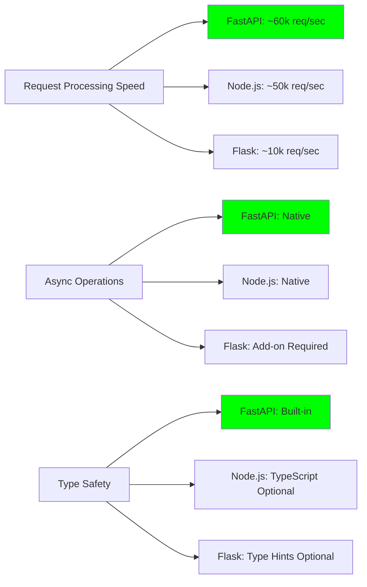
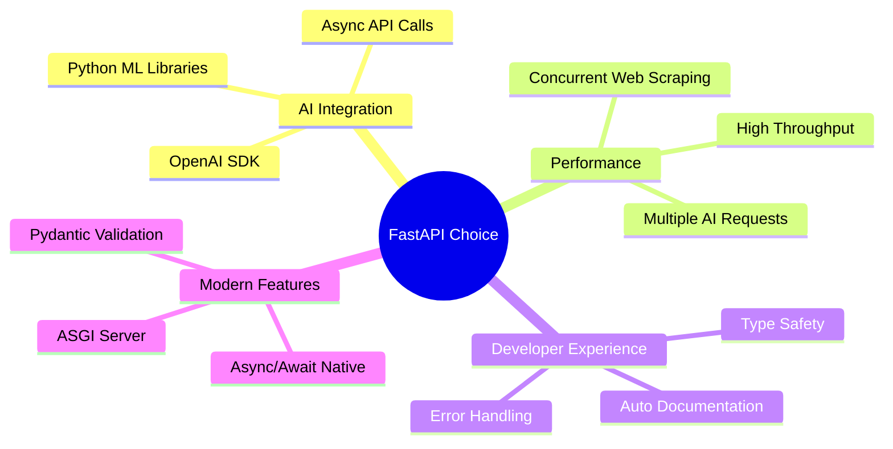

# Backend Framework Comparison

## Flask vs Node.js vs FastAPI

```mermaid
graph TD
    A[Backend Framework Selection] --> B[Flask - Python]
    A --> C[Node.js - JavaScript]
    A --> D[FastAPI - Python]

    B --> B1[Pros]
    B --> B2[Cons]
    B1 --> B1a[Simple & Lightweight]
    B1 --> B1b[Flexible Architecture]
    B1 --> B1c[Large Community]
    B1 --> B1d[Easy to Learn]
    B2 --> B2a[Manual Setup Required]
    B2 --> B2b[No Built-in Async]
    B2 --> B2c[Minimal Features]

    C --> C1[Pros]
    C --> C2[Cons]
    C1 --> C1a[JavaScript Everywhere]
    C1 --> C1b[High Performance]
    C1 --> C1c[NPM Ecosystem]
    C1 --> C1d[Native Async Support]
    C2 --> C2a[Callback Hell]
    C2 --> C2b[Single Threaded]
    C2 --> C2c[Type Safety Issues]

    D --> D1[Pros]
    D --> D2[Cons]
    D1 --> D1a[Native Async/Await]
    D1 --> D1b[Auto API Documentation]
    D1 --> D1c[Type Safety Built-in]
    D1 --> D1d[High Performance]
    D1 --> D1e[Modern Python Features]
    D2 --> D2a[Newer Framework]
    D2 --> D2b[Smaller Community]

    E[Use Cases] --> E1[Flask: Simple Web Apps]
    E --> E2[Node.js: Real-time Apps]
    E --> E3[FastAPI: AI/ML APIs]

    style D fill:#00ff00,stroke:#333,stroke-width:4px
    style D1 fill:#90EE90
    style E3 fill:#90EE90
```



## Performance Comparison



## Architecture Patterns


## Feature Comparison Matrix

| Feature | Flask | Node.js | FastAPI |
|---------|-------|---------|---------|
| **Performance** | ⭐⭐ | ⭐⭐⭐⭐ | ⭐⭐⭐⭐⭐ |
| **Learning Curve** | ⭐⭐⭐⭐⭐ | ⭐⭐⭐ | ⭐⭐⭐⭐ |
| **Async Support** | ⭐⭐ | ⭐⭐⭐⭐⭐ | ⭐⭐⭐⭐⭐ |
| **Type Safety** | ⭐⭐ | ⭐⭐⭐ | ⭐⭐⭐⭐⭐ |
| **Auto Documentation** | ⭐ | ⭐⭐ | ⭐⭐⭐⭐⭐ |
| **Community Size** | ⭐⭐⭐⭐⭐ | ⭐⭐⭐⭐⭐ | ⭐⭐⭐ |
| **AI/ML Integration** | ⭐⭐⭐ | ⭐⭐ | ⭐⭐⭐⭐⭐ |

## Why FastAPI for This Project?



## Code Example Comparison

### Flask
```python
from flask import Flask, request, jsonify
import requests

app = Flask(__name__)

@app.route('/analyze', methods=['POST'])
def analyze():
    data = request.get_json()
    # Synchronous processing only
    result = process_data(data)
    return jsonify(result)
```

### Node.js (Express)
```javascript
const express = require('express');
const app = express();

app.post('/analyze', async (req, res) => {
    try {
        // Good async support
        const result = await processData(req.body);
        res.json(result);
    } catch (error) {
        res.status(500).json({error: error.message});
    }
});
```

### FastAPI
```python
from fastapi import FastAPI
from pydantic import BaseModel

app = FastAPI()

class AnalyzeRequest(BaseModel):
    business_description: str

@app.post("/analyze")
async def analyze(request: AnalyzeRequest):
    # Native async + automatic validation + auto docs
    result = await process_data(request.business_description)
    return result
```

## Conclusion

FastAPI was chosen for this AI Business Intelligence Agent because:

1. **Async Performance**: Critical for concurrent web scraping and AI API calls
2. **Type Safety**: Prevents runtime errors with automatic validation
3. **Auto Documentation**: Self-documenting API at `/docs`
4. **Python Ecosystem**: Best AI/ML library support
5. **Modern Design**: Built for Python 3.7+ with latest best practices

For AI applications requiring high performance and concurrent operations, FastAPI provides the best balance of developer experience and runtime performance.